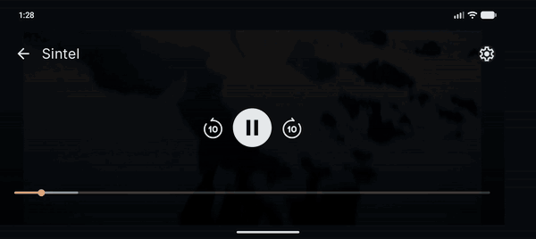
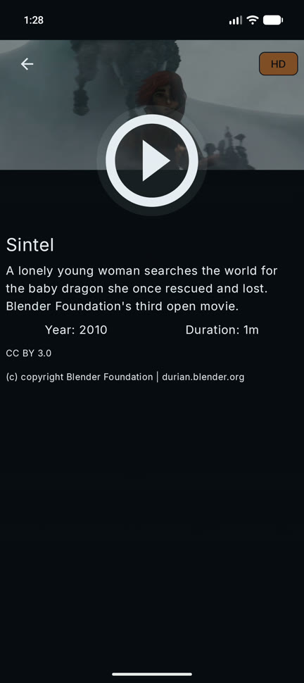
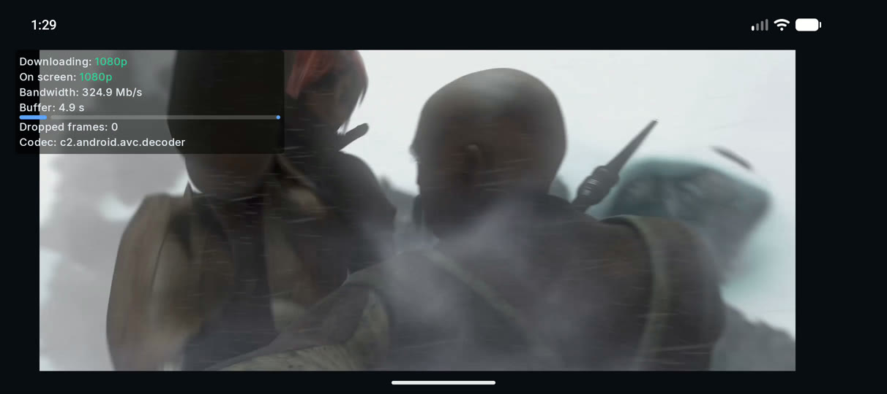
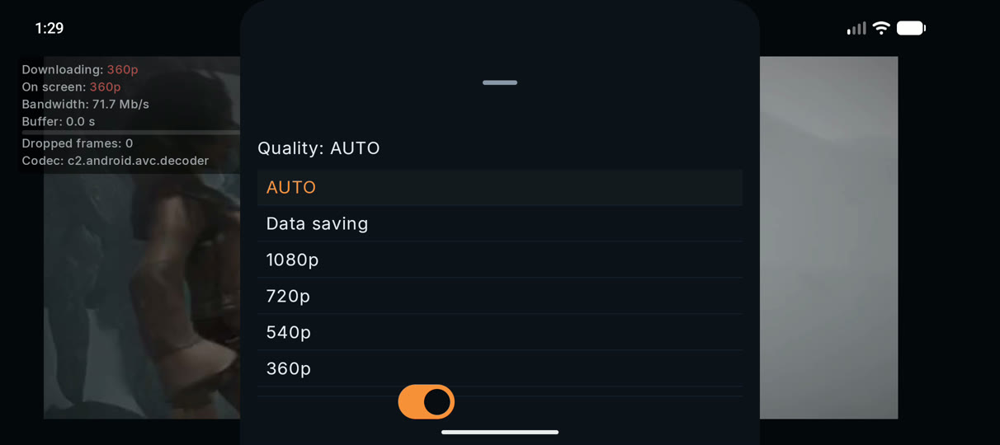

# Buffered

**English** · [Español](README.es.md)

> *An end-to-end streaming platform that shows you what's happening under the hood.*



*The network is throttled to 1.5 Mb/s, then unthrottled, then throttled again, live from the server.
The "Stats for nerds" panel shows the player climb from 360p to 1080p, and then keep choosing 1080p while
the buffer drains to zero. [Why that happens ↓](#what-the-stats-panel-revealed)*

## Why this exists

A few weeks ago I came across a job posting from a big company in the streaming space. One requirement
stood out: *"Good video processing knowledge."* It raised a lot of questions, but the biggest one was:
**how is video actually processed in an Android app?**

So I decided to learn how video works, using AI as a teacher and focusing on hands-on labs over theory:
inspecting streams with FFmpeg, measuring compression, building an adaptive bitrate ladder, and finally
playing my own HLS stream on a real device and watching the player switch qualities as the network changed.

After finishing that lab, I created this repo to put everything I learned together with my Android
development experience, end to end: the encoding pipeline, the server, and the app.

## How it works


1. **Pipeline** — FFmpeg turns each source film into an HLS **bitrate ladder** (1080p / 720p / 540p / 360p)
   with keyframes aligned across qualities, plus posters and a catalog.
2. **Server** — Ktor serves the catalog as a REST API and the HLS segments as files. A demo mode can
   throttle the network on demand.
3. **App** — Android with Media3 (ExoPlayer): catalog, detail and player. A **"Stats for nerds"** panel
   shows what the player is doing: the quality being downloaded vs. the one on screen, the bandwidth
   estimate and the buffer.

| Folder | What it is |
|---|---|
| [`pipeline/`](pipeline/) | FFmpeg: source video → HLS ladder + posters + catalog |
| [`server/`](server/) | Ktor: catalog API + HLS streams |
| [`app/`](app/) | Android: catalog → detail → player (MVI, feature × layer modules) |
| [`docs/`](docs/) | API contract and decisions |

## Screenshots

| Catalog | Detail |
|---|---|
|  |  |

| Player with "Stats for nerds" | Quality menu |
|---|---|
|  |  |

## What the stats panel revealed

**The bandwidth estimate lags behind the network.** Locally the server answers at hundreds of Mb/s, so
ExoPlayer's estimate sits around 300–500 Mb/s. When the demo throttle drops the network to 1.5 Mb/s, the
estimate takes about **18 seconds** to catch up. In the meantime "Auto" keeps choosing 1080p (5 Mb/s),
the buffer drains to zero and playback stalls before the player finally steps down. It's the same thing
that happens when a phone leaves fast Wi-Fi for a weak mobile network.

**Pinning a quality is not the same as capping it.** Picking a fixed quality is a track override: it
turns adaptive bitrate off and throws away what was already buffered (in the demo, 21 s of buffer dropped
to 0 at once). The **Data saving** option is a cap instead (`setMaxVideoSize(1280, 720)`): the player keeps
adapting, just never above 720p.

**"1080p" is a box, not a height.** *Sintel* is 1920×818, so going by its short side it would be "818p".
The labels use the smallest standard box the video fits in, so it's still 1080p.

## Tech stack

- **App:** Kotlin, Jetpack Compose, Media3 ExoPlayer (HLS, `media3-ui-compose`), Koin, Ktor client,
  Coil, type-safe Navigation. MVI in the presentation layer, modules split by feature and layer, and
  Gradle convention plugins (AGP 9).
- **Server:** Ktor, with a shared rate limiter on the media route for the demo mode.
- **Pipeline:** Python (standard library only) driving FFmpeg.
- **Tests:** JUnit 4, AssertK, kotlinx-coroutines-test, Ktor `MockEngine` and Robolectric.

## Running it locally

You need `ffmpeg`, Python 3, a JDK and Android Studio (or just the Android SDK).

```bash
# 1. Generate the media (downloads the films and trims them to 60 s)
python3 pipeline/pipeline.py --max-seconds 60

# 2. Start the server (demo mode enables the network throttle)
cd server && BUFFERED_DEMO=true ./gradlew run

# 3. Install the app (the emulator reaches the host at 10.0.2.2:8080)
cd app && ./gradlew installDebug
```

To throttle the network while you watch: `curl -X PUT "http://localhost:8080/demo/throttle?mbps=1.5"`
(`mbps=0` removes the limit).

On a physical device, run `adb reverse tcp:8080 tcp:8080` and add `BASE_URL="http://localhost:8080"`
to `app/local.properties`.

Tests: `./gradlew testDebugUnitTest` in `app/` and `./gradlew test` in `server/`.

## Content and licenses

All videos are either Creative Commons or public domain:
*Big Buck Bunny*, *Sintel*, *Tears of Steel* and *Elephants Dream* © Blender Foundation (CC BY), and
*Night of the Living Dead* (1968), *The General* (1926) and *The Immigrant* (1917) (public domain).
*The General* is served without audio, because the music added to this copy may be copyrighted.
Full attribution is in [`pipeline/videos.json`](pipeline/videos.json) and inside the app.
